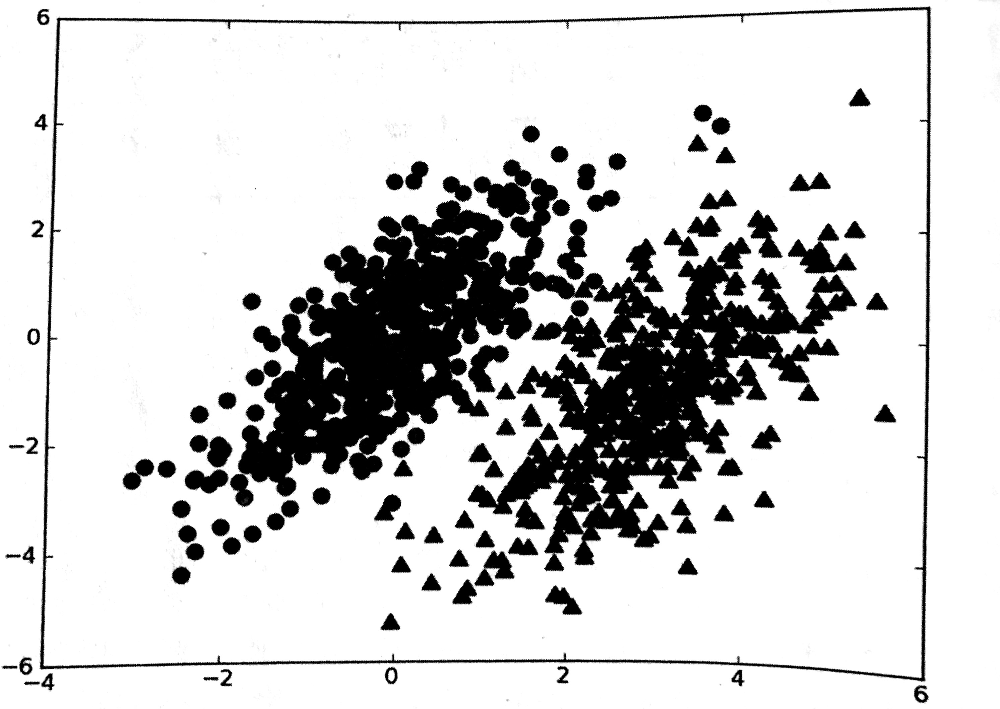
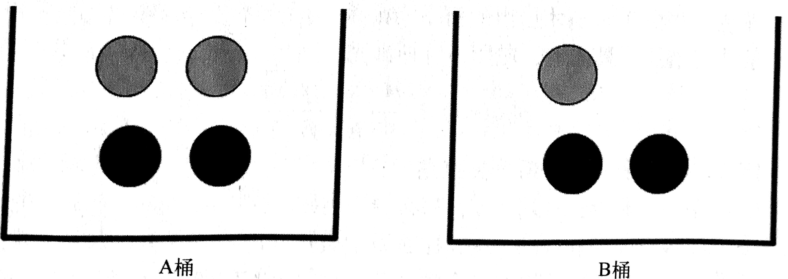

## 朴素贝叶斯-基于概率论的分类方法
===

#### 简述

之前我们分别使用`k-近邻算法`、`决策树`来做出类别区分，给出`该数据具体属于哪一类`这类问题的明确答案，不过，分类器有时候会产生错误的结果，这时候可以要求分类器给出一个最优的类别猜测结果，同时给出这个猜测的概率估计值。

`概率论`是许多机器学习算法的基础，在学习`决策树`算法的时候，我们简单的接触了一下特征值的概率，先得到特征值的频次，然后除以数据集的实例总数。接下来我们会先学习一个简单的概率分类器，然后给出一些假设来学习文题`朴素贝叶斯`分类器。

###### 基于贝叶斯决策理论的分类方法

> 优点：在数据少的情况下仍然有效，可以处理多类别问题
> 缺点：对于输入数据的准备方式较为敏感
> 适用数据类型：标称型

朴素贝叶斯，是贝叶斯决策理论的一部分，所以讲述朴素贝叶斯之前，有必要简单的了解一下贝叶斯决策理论。假设我们现在有一个数据集，它由两类数据组成：



假设有位读者找到了描述图中的两类数据的统计参数，我们现在用p1(x, y)标识数据点(x, y)属于类别1（上图中用圆点表示）的概率，用p2(x, y)表示点(x, y)属于类别2的概率，那么对于一个新的数据点(x, y)，可以用以下规则来判断它的类别：

- 如果 p1(x, y) > p2(x, y)，那么为类别1
- 如果 p2(x, y) > p1(x, y)，那么为类别2

也就是说，我们会选择概率高对应的类别，这就是贝叶斯决策论的核心思想，即选择具有最高概率的决策，而且话说回来，就用上图来说，如果使用该图中的整个数据使用6个浮点数来表示（整个数据由2类不同分布的数据构成，有可能只需要6个统计参数来描述），并且按照上面的公式计算只有2行代码，你会更倾向于哪种方法呢？

- 使用k-近邻算法，进行1000次距离计算
- 使用决策树算法，分别沿x轴，y轴划分数据
- 计算数据点属于每个类别的概率，并进行比较

使用决策树不会非常成功，而和简单的概率计算相比，k-近邻算法的计算量又太大，所以最佳选择还是其三。接下来，我们必须要了解p1以及p1的计算方法，为了能够计算p1与p2，有必要讨论一下条件概率。

###### 条件概率

如果不了解概率与条件概率，那么看这小节可以帮助大家稍有理解，如果对条件概率很熟悉，那么直接跳过到下一个6号小标题吧。

假设，现在有一个装了7块儿石头的罐子，3块儿是灰色的，4块儿是黑色的，如果我们随机取出来一块儿，是灰色的概率是3/7，是黑色的概率是4/7.我们使用 p(gray) 来表示取到灰色石头的概率，其概率可以通过 灰色石头的数量/总数 来获得。那么，如果这7块儿石头放到2个桶里，概率又是多少呢？



要计算 p(gray) 或者 p(black) ，事先得知道石头所在桶的信息会不会改变结果，你有可能已经想到计算从B桶中取到灰色石头的概率的办法，这就是所谓的`条件概率`。假定计算的是从B桶取到灰色石头的概率，这个概率可以记作 p(gray|bucketB) ，我们称之为，`在已知石头出自B桶的条件下，取出灰色石头的概率`。不难得到，p(gray|bucketA) 的值为 2/4，p(gray|bucketB) 的值为 1/3。条件概率的计算公式如下：

```
p(gray | bucketB) = p(gray in bucketB) / p(bucketB)
```

解释一下：

- p(gray in bucketB)：用B桶中的灰色石头，除以两个桶的总石头数
- p(bucketB)：石头来自B桶的概率

另一种有效计算条件概率的方法称为贝叶斯准则，贝叶斯准则告诉我们如何交换条件概率中的条件与结果，即如果已知 p(x|c) ，要求得 p(c|x) ，那么可以使用下面的算方法：

```
p( c | x ) = p( x | c ) * p ( c ) / p( x )
```

下面我们来说，如何结合贝叶斯决策理论使用条件概率。

###### 使用条件概率来分类

之前我们提到了 p(x, y) 如何判断类别，但是其实这并不是我们要看的核心内容，我们真正要处理的是 p( c1|x, y ) 和 p( c2|x, y ) ，他们的具体意义是：

- 给定某个由 x, y 表示的数据点，那么该数据来自类别 c1 的概率是多少。

注意这些概率与刚才给出的概率 p(x, y|c1)并不一样，不过可以使用贝叶斯准则来交换概率中的条件与结果，具体的，应用贝叶斯准则得到：

```
p( ci | x, y ) = p( x, y | ci ) * p( ci ) / p( x, y )
```

> 注：上述的i为下角标

使用这些定义，可以定义贝叶斯分类准则为：

- 如果 p( c1|x, y ) > p( c2|x, y ) ，那么属于类别c1
- 如果 p( c1|x, y ) < p( c2|x, y ) ，那么属于类别c2

使用贝叶斯准则，可以通过三个已知的概率值来计算未知的概率值，那么如何付诸实践呢？

#### 使用朴素贝叶斯进行文档分类

机器学习的一个重要应用就是文档的自动分类，在分档分类中，整个文档是实例，比如说一封点子邮件，而电子邮件中的某些元素则构成特征。我们可以观察文档中出现的词，并把每个词的出现或者不出现作为一个特征，这样得到的特征数目就会跟词汇表中的词目一样多。朴素贝叶斯是上节介绍的贝叶斯分类器的一个扩展，是用于分档分类的常用算法。

朴素贝叶斯的一般过程：

- 收集数据：下面例子使用的是rss源
- 准备数据：需要数值型或者bool型数据
- 分析数据：有大量特征时，绘制特征的作用不大，此时使用直方图效果更好
- 训练算法：计算不同的独立特征的条件概率
- 测试算法：计算错误率
- 使用算法：一个常见的朴素贝叶斯应用是文档分类，可以在任意的分类场景中使用朴素贝叶斯分类器，不一定非要是文本

假设词汇表中有1000个单词，要得到好的分布概率，就需要足够的样本，假定样本数为N，前边我们有约会网站的数据，1000个样本，这就非常的好。有统计学知，如果每个特征需要N个样本，那么对于10个特征将需要N的10次方个样本，对于包含1000个特征的词汇表将需要N的1000次个样本，可以看到，所需要的样本数会随着特征数目的增大而迅速增长。
如果特征之间相互独立，那么样本数就可以从N的1000次减少到 `1000*N`，所谓独立，指的是统计意义上的独立，即一个特征或者单词出现的可能性与他和其他单词相邻都没有关系。朴素贝叶斯分类器中的另一个假设是，每个特征同等重要。但是我们宏观的看，这些假设貌似有一些小的下次，但是朴素贝叶斯的实际效果却很好。到目前为止，我们了解了一堆理论性的东西，接下来我们开始编代码了。

##### 使用Python进行文本分类

要从文本中获取特征，需要先拆分文本，这里的特征是来自于文本的词条，一个词条可能是字符的任意组合。可以把词条想象为单词，也可以使用非单词词条，如URL，IP地址或者任意其他的字串。然后将每一个文本片段表示为一个词条向量，其中值为1表示词条出现在文本中，为0表示词条未出现。

我们把文本看成单词向量或者词条向量，也就是说要将桔子转换为向量，考虑出现在所有文档中的所有单词，再决定将哪些词汇录入词汇表或者说所要的词汇集合，然后必须要将每一篇文档转换为词汇表上的向量。

###### 准备数据，从文本中构建词向量

新建一个bayes.py的文件，在其中加入如下方法：

```python
from numpy import *

# 创建一些实验样本，该函数返回的第一个变量是进行词条切分后的文档集合，这里的标点符号暂时去掉了，后边我们会讨论文本处理的细节
# 返回的第二个值是一个类别标签的集合，这里有2类，侮辱性和非侮辱性。这些文本的类别由人工标注，这些标注信息用于训练程序以便自动检测侮辱性的语言
def loadDataSet():
    postingList=[['my', 'dog', 'has', 'flea', 'problems', 'help', 'please'],
                 ['maybe', 'not', 'take', 'him', 'to', 'dog', 'park', 'stupid'],
                 ['my', 'dalmation', 'is', 'so', 'cute', 'I', 'love', 'him'],
                 ['stop', 'posting', 'stupid', 'worthless', 'garbage'],
                 ['mr', 'licks', 'ate', 'my', 'steak', 'how', 'to', 'stop', 'him'],
                 ['quit', 'buying', 'worthless', 'dog', 'food', 'stupid']]
    classVec = [0,1,0,1,0,1]    #1 is abusive, 0 not
    return postingList,classVec

# 创建一个包含在所有文档中出现的不重复词的列表，为此使用了set数据类型。
def createVocablist(dataSet): 
    vocabSet = set([])

    for document in dataSet :
        vocabSet = vocabSet | set(document)

    return list(vocabSet)

# 输入参数为：1. 词汇表 2. 某个文档
# 输出： 文档向量，向量的每一元素为0或者1，分别标识词汇表中的单词在输入文档中是否出现
def setOfWords2Vec(vocablist, inputSet) :
    returnVec = [0] * len(vocablist) # 创建一个与词汇表等长的向量，将其元素都设置为0

    for word in inputSet : # 遍历文档中所有的单词，如果出现了词汇表中的单词，则将输出的文档向量的对应值设置为1
        if word in vocablist :
            returnVec[vocablist.index(word)] = 1
        else : 
            print "the word %s is not in my vocabulary" % word

    return returnVec
```

运行结果：

```python
>>> import bayes
>>> listOPosts, listClasses = bayes.loadDataSet()
>>> myVocabList = bayes.createVocablist(listOPosts)
>>> myVocabList
['cute', 'love', 'help', 'garbage', 'quit', 'I', 'problems', 'is', 'park', 'stop', 'flea', 'dalmation', 'licks', 'food', 'not', 'him', 'buying', 'posting',
'has', 'worthless', 'ate', 'to', 'maybe', 'please', 'dog', 'how', 'stupid', 'so', 'take', 'mr', 'steak', 'my']
>>> bayes.setOfWords2Vec(myVocabList, listOPosts[0])
[0, 0, 1, 0, 0, 0, 1, 0, 0, 0, 1, 0, 0, 0, 0, 0, 0, 0, 1, 0, 0, 0, 0, 1, 1, 0, 0, 0, 0, 0, 0, 1]
>>> bayes.setOfWords2Vec(myVocabList, listOPosts[3])
[0, 0, 0, 1, 0, 0, 0, 0, 0, 1, 0, 0, 0, 0, 0, 0, 0, 1, 0, 1, 0, 0, 0, 0, 0, 0, 1, 0, 0, 0, 0, 0]
```

###### 训练算法，从词向量计算概率


