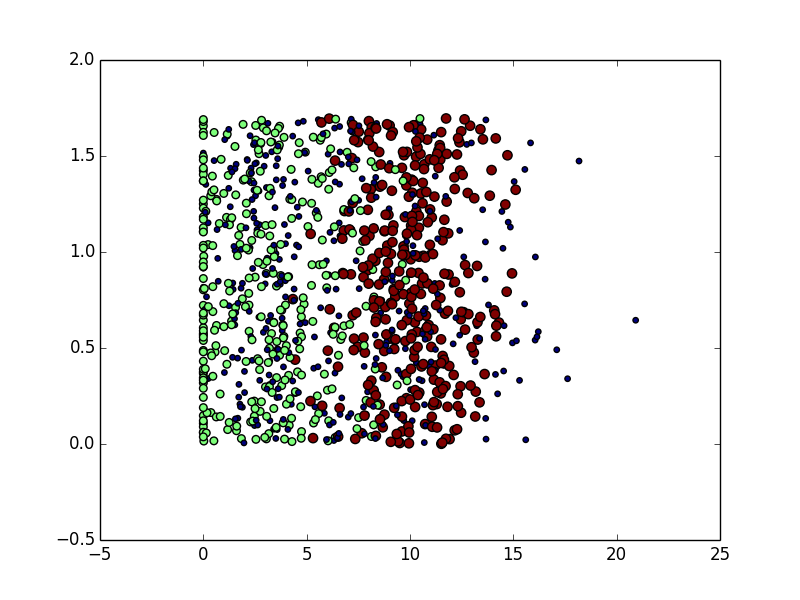
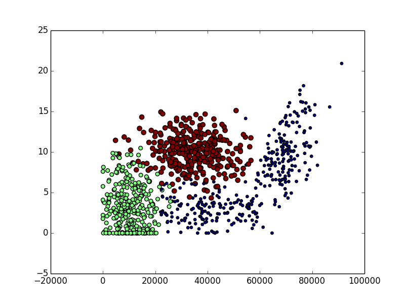

先来一个简单的例子，我们如何来区分动作类电影与爱情类电影呢？动作片中存在很多的打斗镜头，爱情片中可能更多的是亲吻镜头，所以我们姑且通过这两种镜头的数量来预测这部电影的主题。简单的说，`k-近邻算法`采用了测量不同特征值之间的距离方法进行分类。

> 优点：精度高、对异常值不敏感、无数据输入假定
> 缺点：计算复杂度高、控件复杂度高
> 适用数据范围：数值型和标称型

首先我们来理解它的工作原理：

存在一个样本数据集（训练集），并且我们知道每一数据与目标变量的对应关系，输入没有标签的新数据后，将新数据的每个特征与样本集中数据对应的特征进行比较，然后算法提取样本集中最相近的分类标签，一般来说，我们只选择样本集中前k个最相似的数据，通常k为不大于20的整数，最后，选择k个最相似数据中出现次数最多的分类，作为新数据的分类。

现在我们回到文章开头所提到的电影的例子，根据下表如何确定未知的电影类型呢？

| 电影名称 | 打斗镜头 | 接吻镜头 | 电影类型 |
| ---- | ---- | ---- | ---- |
| 电影1  | 3    | 104  | 爱情   |
| 电影2  | 2    | 100  | 爱情   |
| 电影3  | 1    | 81   | 爱情   |
| 电影4  | 101  | 10   | 动作   |
| 电影5  | 99   | 5    | 动作   |
| 电影6  | 98   | 2    | 动作   |
| 电影7  | 18   | 90   | 未知？  |

该如何计算电影7的电影类型呢？计算电影7与样本集中其他电影的距离，然后我们假定k=3，看一下最近的3部电影是什么类型即可预测出电影7的电影类型。

#### 流程介绍

- 收集数据
- 准备数据：距离计算所需要的值，最好是结构化的数据格式
- 分析数据
- 测试算法：计算错误率
- 使用算法

#### 开始工作

###### 使用python导入数据

首先，创建名为kNN.py的Python模块，在构造算法之前，我们还需要编写一些通用的函数等，我们先写入一些简单的代码：

```python
from numpy import *
import operator

def createDataSet():
    group = array([
      [1.0, 1.1], 
      [1.0, 1.0],
      [0, 0],
      [0, 0.1]
    ])

    labels = ["A", "A", "B", "B"]

    return group, labels
```

然后将终端改变到代码文件目录，输入命令python进入到交互界面：

```python
>>> import kNN

>>> group, labels = kNN.createDataSet()

>>> group
array([[ 1. ,  1.1],
       [ 1. ,  1. ],
       [ 0. ,  0. ],
       [ 0. ,  0.1]])
>>> labels
['A', 'A', 'B', 'B']
```

这里有4组数据，每组数据有2个我们已知的特征值，上面的group矩阵每行为一条数据，对于每个数据点我们通常使用2个特征（所以特征的选择很重要），向量labels包含了每个数据点的标签信息，labels的维度等于矩阵的行数，这里我们将`[1, 1,1]`定为类A，`[0, 0.1]`定为类B，接下来我们进行算法的编写：

- 计算已知数据集中点到当前点之间的距离
- 按照距离递增次序排序
- 选取与当前点距离最小的k个点
- 确定前k个点所在类别的出现频率
- 返回前k个点中频次最高的类别作为预测类别

接着定义函数：

```python
# inX: 用于分类的输入向量
# dataSet：输入的训练集
# labels：标签向量
# k：选择近邻项目的个数
def classify0(inX, dataSet, labels, k) :
    dataSetSize = dataSet.shape[0]
    # 距离计算
    diffMat = tile(inX, (dataSetSize, 1)) - dataSet
    sqDiffMat = diffMat ** 2 # python中, **2 代表2平方，**0.5代表开方
    sqDistances = sqDiffMat.sum(axis=1) # 加入axis=1以后就是将一个矩阵的每一行向量相加
    distances = sqDistances ** 0.5
    sortedDistIndicies = distances.argsort()
    classCount = {}

    # 选择距离最小的k个点
    for i in range(k) :
        voteILabel = labels[sortedDistIndicies[i]]
        classCount[voteILabel] = classCount.get(voteILabel, 0) + 1
    
    # 排序
    sortedClassCount = sorted(classCount.iteritems(), key = operator.itemgetter(1), reverse=True)
    return sortedClassCount[0][0]
```

然后我们进行测试，重新打开python编译环境：

```python
>>> import kNN
>>> group, labels = kNN.createDataSet()
>>> kNN.classify0([0, 0], group, labels, 3)
'B'
>>> kNN.classify0([0.3, 0], group, labels, 3)
'B'
>>> kNN.classify0([0.8, 0.9], group, labels, 3)
'A'
```

我们看到，一个简单的分类器就这样搞定了。这时，我们来将电影数据进行样本写入：

```python
def createDataSet():
    group = array([
      [3, 104], 
      [2, 100],
      [1, 81],
      [101, 10],
      [99, 5],
      [98, 2]
    ])

    labels = ["love", "love", "love", "action", "action", "action"]

    return group, labels
```

```python
>>> import kNN
>>> group, labels = kNN.createDataSet()
>>> kNN.classify0([18, 90], group, labels, 3)
'love'
```

我们看到预测结果为爱情片。这是一个简单的分类器，当然，我们应该通过大量的测试，看预测结果与预期结果是否相同，进而得出错误率，完美的分类器错误率为0，最差的错误率为1，上边电影分类的例子已经可以使用了，但是貌似没有太大的作用，下边我们来看一个生活中的实例，使用k-近邻算法改进约会网站的效果，然后使用k-近邻算法改进手写识别系统。

#### 改进约会网站的配对效果

有个姑娘，一直在使用某交友网站，但是推荐来的人总是不尽人意，她总结了一番，曾交往过3中类型的人：

- 不喜欢的人
- 魅力一般的人
- 极具魅力的人

她觉得自己可以在周一~周五约会那些魅力一般的人，周末与那些极具魅力的人约会，因为她希望我们可以更好的帮助她将匹配的对象划分到确切的分类中，她还收集了一些约会网站未曾记录过的数据信息，她认为这些数据信息会有帮助。这些数据存放在代码文件夹下`datingTestSet2.txt`中，总共有1000行数据（妹的约了1000个人），主要包含以下特征：

- 每年获得的飞行常客里程数
- 玩视频游戏所消耗的时间百分比
- 每周消费的冰激凌公升数

我们看到，统计的东西都比较奇葩，我们先从文件中把这些数值解析出来，输出训练样本矩阵和分类标签向量。在kNN.py中继续书写代码：

- 从文本中读入数据

```python
def file2matrix(filename) :
    fr = open(filename)
    arrayOfLines = fr.readlines()
    numberOfLines = len(arrayOfLines) # 得到文件行数
    returnMat = zeros((numberOfLines, 3)) # 创建用0填充的矩阵，这里为了简化处理，我们将矩阵的另一个纬度设置为3，可以按照自己的需求增加数量。

    classLabelVector = []
    index = 0
    # 解析文件
    for line in arrayOfLines : 
        line = line.strip() # 截取掉所有的回车字符
        listFromLine = line.split('\t')
        returnMat[index, :] = listFromLine[0: 3] # range
        classLabelVector.append(int(listFromLine[-1]))
        index += 1

    return returnMat, classLabelVector
```

```python
>>> import kNN
>>> mat, vector = kNN.file2matrix('datingTestSet2.txt')

>>> mat, vector = kNN.file2matrix('datingTestSet2.txt')
>>> mat
array([[  4.09200000e+04,   8.32697600e+00,   9.53952000e-01],
       [  1.44880000e+04,   7.15346900e+00,   1.67390400e+00],
       [  2.60520000e+04,   1.44187100e+00,   8.05124000e-01],
       ...,
       [  2.65750000e+04,   1.06501020e+01,   8.66627000e-01],
       [  4.81110000e+04,   9.13452800e+00,   7.28045000e-01],
       [  4.37570000e+04,   7.88260100e+00,   1.33244600e+00]])
>>> vec
Traceback (most recent call last):
  File "<stdin>", line 1, in <module>
NameError: name 'vec' is not defined
>>> vector
[3 ... 2]
```

现在我们已经从文文件中导入了数据，并将其格式化为想要的格式，接着我们需要了解数据的真是含义，我们可以直观的浏览文本文件，但是这种方法非常不友好，一般来说，我们会采用图形化的方式直观的展示数据。下面我们就用Python图形化工具来图形化展示数据内容，以便辨识出一些数据模式。

- 分析数据，使用`Matplotlib`创建散点图

```shell
pip install matplotlib
```

接下来打开python命令行，我们对刚才读入的内容进行测试的展示

```python
>>> from matplotlib import *
>>> import matplotlib.pyplot as plt
>>> import kNN
>>> import numpy as np
>>> mat, vec = kNN.file2matrix('datingTestSet2.txt')
>>> fig = plt.figure()
>>> ax = fig.add_subplot(111)
>>> ax.scatter(mat[:, 1], mat[:, 2], 15.0*np.array(vec), 15.0*np.array(vec))
<matplotlib.collections.PathCollection object at 0x1087cf0d0>
>>> plt.show()
```



这个时候，我们展示的是数据集的第一列与第二列所绘制的图，这里我们很难看出来什么端倪，所以我们尝试使用第一列和第二列作为特征来绘图，重新书写上边代码：

```shell
ax.scatter(mat[:, 0], mat[:, 1], 15.0*np.array(vec), 15.0*np.array(vec))
```

然后我们得到了以下数据图：



这次，我们可以看到，图中清晰的标识了3个不同的样本分类区域。

- 准备数据，归一化数值

我们随便的抽取了4组差异比较大的数据

|      | 玩游戏所消耗时间 | 里程数   | 冰激凌公升数 | 样本分类 |
| ---- | -------- | ----- | ------ | ---- |
| 1    | 0.8      | 400   | 0.5    | 1    |
| 2    | 12       | 13400 | 0.9    | 3    |
| 3    | 0        | 20000 | 1.1    | 2    |
| 4    | 67       | 32000 | 0.1    | 2    |

我们很容易发现，如果我们计算样本3和样本4之间的距离，可以使用下边的方法

$\sqrt{(0-67)^2 + (20000 + 32000)^2 + (1.1-0.1)^2}$

但是这些大的值堆结果的影响比较大，因此，作为比较重要的特征属性，不应该如此的影响计算结果，所以在处理数据的时候，我们对数据进行归一化处理，将取值的范围处理到0 - 1或者-1 ~ -1之间，下面的公事，可以将任意范围内的特征值转换为0-1区间内的值：

$newValue = (oldValue - min)/(max - min)$

其中，min和max分别为特征值中最大和最小值，虽然改变数值范围增加了分类器的复杂度，但是为了得到准确的结果，必须这样做，所以我们在kNN.py中新增一个函数`autoNorm()`，用来将数字特征值转化为0-1的区间：

```python
def autoNorm(dataSet) :
    minvals = dataSet.min(0) # 存放每列的最小值
    maxVals = dataSet.max(0) # 存放每列的最大值

    ranges = maxVals - minvals
    normDataSet = zeros(shape(dataSet))
    m = dataSet.shape[0]
    normDataSet = dataSet - tile(minvals, (m, 1))
    # 特征值相除
    normDataSet = normDataSet / tile(ranges, (m, 1))
    return normDataSet, ranges, minvals
```

运行结果：

```python
>>> import kNN
>>> mat, vec = kNN.file2matrix('datingTestSet2.txt')
>>> a, b, c = kNN.autoNorm(mat)
>>> a
array([[ 0.44832535,  0.39805139,  0.56233353],
       [ 0.15873259,  0.34195467,  0.98724416],
       [ 0.28542943,  0.06892523,  0.47449629],
       ...,
       [ 0.29115949,  0.50910294,  0.51079493],
       [ 0.52711097,  0.43665451,  0.4290048 ],
       [ 0.47940793,  0.3768091 ,  0.78571804]])
```

这样一来，我们把值处理成了我们预期的范伟内的值。

- 测试算法

通常我们把数据集的90%的数据当做训练集，余下的10%作为测试集，着10%的数据是随机选择的。 下面，我们来书写测试程序，并通过`datingTestSet.txt`来测试程序：

```python
def datingClassTest() :
    hoRatio = 0.10 # 设置抽取多少数据进行测试集
    datingDataMat, datingLabels = file2matrix('datingTestSet2.txt') # 读入数据集
    normMat, ranges, minVals = autoNorm(datingDataMat) # 转化特征值至 0 - 1 区间内
    m = normMat.shape[0] 
    numTestVecs = int( m * hoRatio ) # 计算测试向量的数量
    errorCount = 0.0 

    for i in range(numTestVecs) :
        classifierResult = classify0(normMat[i, :], normMat[numTestVecs:m, :], datingLabels[numTestVecs: m], 3) # 使用近邻算法得出结果

        print "the classifier came back with: %d, the real answer is: %d" % (classifierResult, datingLabels[i])
        if (classifierResult != datingLabels[i]) : errorCount += 1.0 # 错误记录与处理等

    print "the total error rate is: %f" % (errorCount / float(numTestVecs))
```

然后我们在python环境中通过

```shell
reload(kNN)
```

来重新加载kNN.py模块，然后调用

```python
kNN.datingClassTest()
```

得到结果:

```
the classifier came back with: 3, the real answer is: 3
the classifier came back with: 2, the real answer is: 2
the classifier came back with: 1, the real answer is: 1
the classifier came back with: 1, the real answer is: 1
the classifier came back with: 1, the real answer is: 1
...
the classifier came back with: 3, the real answer is: 3
the classifier came back with: 3, the real answer is: 3
the classifier came back with: 2, the real answer is: 2
the classifier came back with: 1, the real answer is: 1
the classifier came back with: 3, the real answer is: 1
the total error rate is: 0.050000
```

所以我们看到，数据集的错误率是2.4%，这里会有一定的偏差，因为我们随机选取的数据可能会不同。

- 使用算法

我们使用上面建立好的分类器构建一个可用的系统，通过输入这些特征值帮她预测喜欢程度。我们来编写代码：

```python
def classifyPerson() :
    resultList = ['not', 'small doses', 'large does']
    percentTats = float(raw_input("percent of time spent on video games?"))
    miles = float(raw_input("flier miles per year?"))
    ice = float(raw_input("liters of ice-cream?"))

    datingDataMat, datingLabels = file2matrix('datingTestSet2.txt')
    normMat, ranges, minVals = autoNorm(datingDataMat)

    inArr = array([miles, percentTats, ice])
    classifierResult = classify0((inArr - minVals) / ranges, normMat, datingLabels, 3)
    print "you will like this person: ", resultList[classifierResult - 1]	
```

这里的代码大家比较熟悉了，就是加入了raw_input用于输入，我们来看结果：

```python
>>> reload(kNN)
<module 'kNN' from 'kNN.py'>
>>> kNN.classifyPerson()
percent of time spent on video games?10
flier miles per year?10000
liters of ice-cream?0.5
you will like this person:  small doses
```

我们在做近邻算法的时候也发现，并没有做`训练算法`这一环节，因为我们不需要训练，直接计算就好了。

同时我们也发现一个问题，k-近邻算法特别慢，它需要对每一个向量进行距离的计算，这该怎么优化呢？