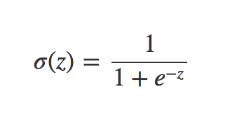
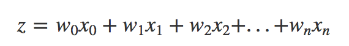
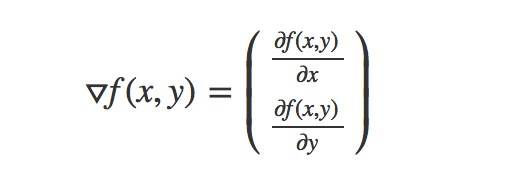
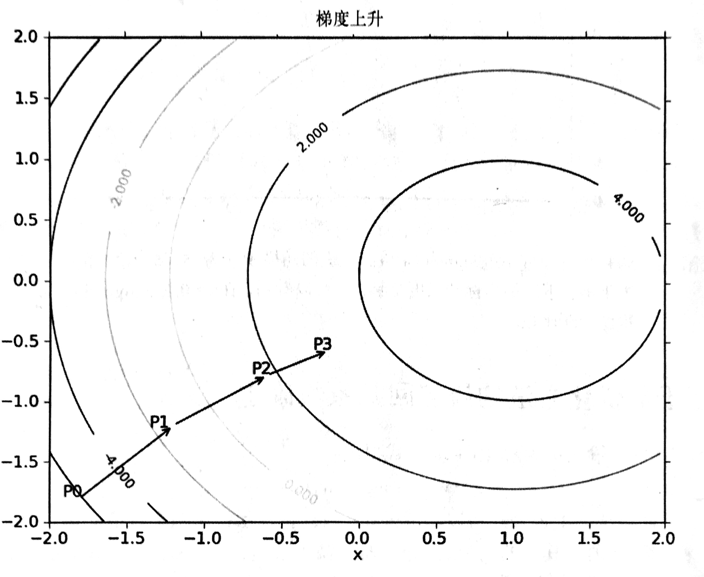
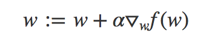
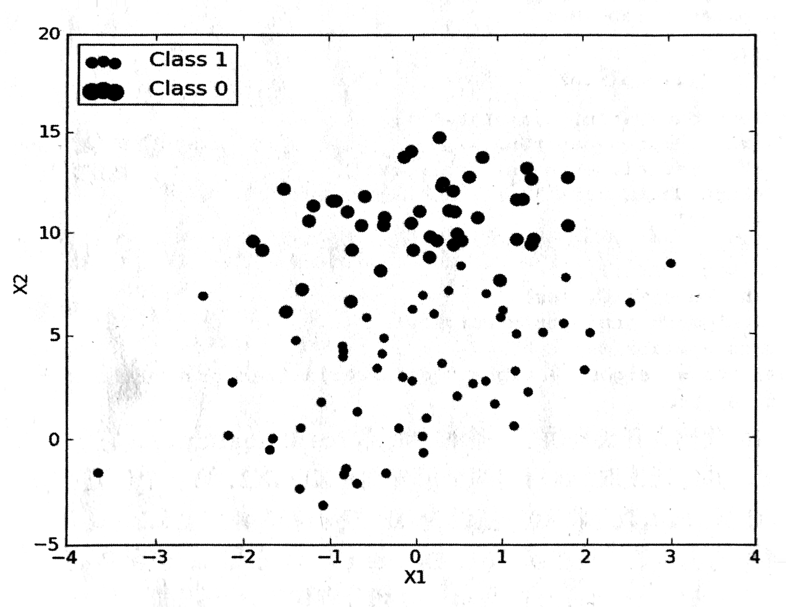
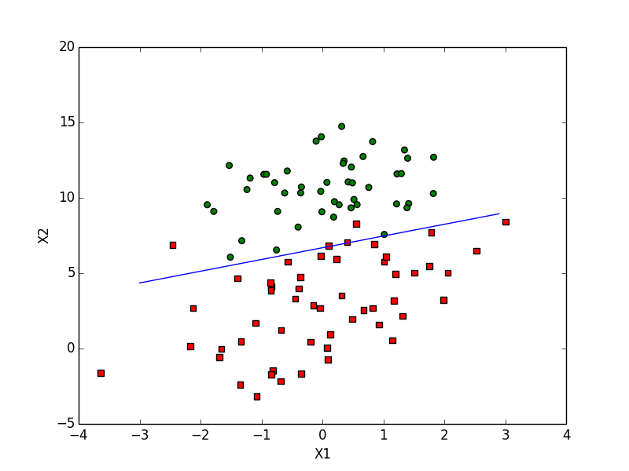
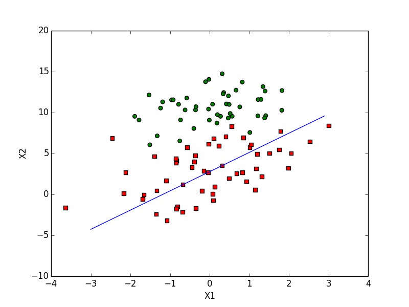
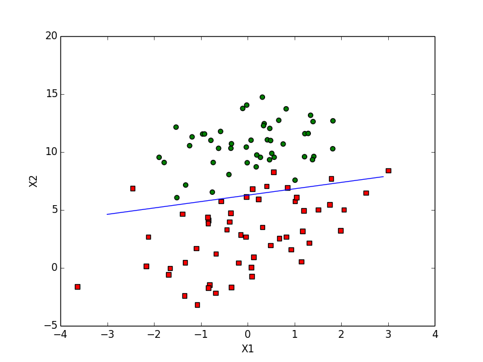
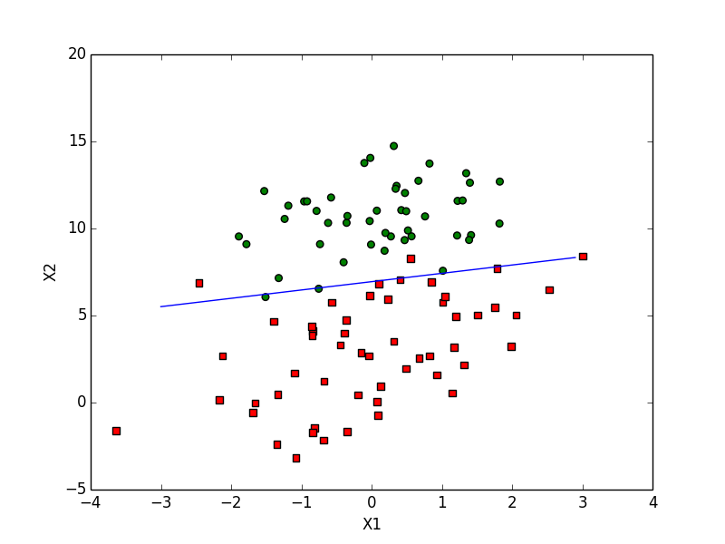

## Logistic回归
===

这会是激动人心的一章，因为我们将首次接触到最优化算法。假设现在有一些数据点，我们用一条直线对这些点进行拟合（该线称为最佳拟合直线），这个拟合过程就称作回归。利用Logistic回归进行分类的主要思想是：根据现有数据对分类边界线建立回归公式，以此进行分类。这里的『回归』一词源于最佳拟合，表示要找到最佳拟合参数集，其背后的数学分析将在下一部分介绍。训练分类器时的做法就是寻找最佳拟合参数，使用的是最优化算法。

- 收集数据：采用任意方法收集数据
- 准备数据：由于需要进行距离运算，因此要求数据类型为数值型，另外，结构化数据格式最佳
- 分析数据：采用任意方法对数据进行分析
- 训练算法：大部分时间将用于训练，训练的目的是为了找到最佳的分类回归系数
- 测试算法：一旦训练步骤完成，分类将会很快
- 使用算法：首先，我们需要输入一些数据，并将其转化为对应的结构化数值；接着，基于训练好的回归系数就可以对这些数值进行简单的回归计算，判定他们属于哪个类别；最后，我们就可以在输出的类别上做一些其他的分析工作

#### 基于Logistic回归和Sigmoid函数的分类

> 优点：计算代价不高，易于理解和实现
> 缺点：容易欠拟合，分类精度可能不高
> 适用数据类型：数值型和标称型

我们想要的函数应该是，能接受所有的输入然后预测出类别。例如，在两个类的情况下，上述函数输出0或1。或许你之前接触过有这种性质的函数，该函数被称为`海维塞德阶跃函数`，或者直接称为`单位阶跃函数`。然而，海维塞德阶跃函数的问题在于：该函数在跳跃点上从0瞬间跳跃到1，这个瞬间跳跃过程有时很难处理。幸好，另一个函数也有类似的性质，而且数学上更易处理，这就是`Sigmoid`函数，它的具体计算公式如下：



我们看一下根据上述公式在不同的坐标尺度下的两条曲线图。当x为0时，Sigmoid函数值为0.5，。随着x的增大，对应的Sigmoid的值将逼近于1；而随着x的减小，Sigmoid的值逼近于0.如果横坐标刻度足够大，Sigmoid函数看起来很像一个阶跃函数。


因此，为了实现Logistic回归分类器，我们可以在每个特征上都乘以一个回归系数，然后把所有的结果值相加，将这个总和代入Sigmoid函数中，进而得到一个范围在 0 ~ 1 之间的数值。任何大于0.5的数据被分为1类，小于0.5的即被归位0类，所以，Logistic回归也可以被看成是一种概率估计。在确定了分类器的函数形式之后，现在的问题变成了：最佳回归系数是多少？如何确定它们的大小？

#### 基于最优化方法的最佳回归系数确定

Sigmoid函数的输入记为z，由下面的公式得出：



如果采用向量的写法，上述公式可以写成 z = w的T次 * x，它表示将两个数值向量对应元素相乘后相加得到z值。其中的向量x是分类器的输入数据，向量w也就是我们要找到的最佳参数（系数），从而使分类器尽可能的精确。为了寻找最佳系数，需要用到最优化理论的一些只是。下面首先介绍`梯度上升`这一最优化方法，我们将学习如何使用该方法求得数据集的最佳参数。

###### 梯度上升法

梯度上升法基于的思想是：要找到某函数的最大值，最好的方法是沿着该函数的梯度方向探寻。如果梯度记为▽，则函数 f(x, y) 的梯度由下表示：



这是机器学习中一个混淆的地方，但在数学上并不难，需要做的只是牢记这些符号的意义。这个梯度意味着要沿x的方向移动 ∂f(x ,y) / ∂x，沿y的方向移动 ∂f(x, y) / ∂y。其中，函数 f(x, y) 必须要在待计算的点上有定义并且可微，一个具体的例子图：



> 梯度上升算法到达每个点后都会重新估计移动的方向。从p0开始，计算完该点的梯度，函数就根据梯度移动到下一个点p1，在p1点，梯度再次被重新计算，并沿新梯度方向移动到p2，如此循环迭代，知道满足停止条件。迭代的过程中，梯度算子总是保证我们能选取到最佳的移动方向

上图中的梯度上升算法沿梯度方向移动了一步，可以看到，梯度算子总是指向函数值增长最快的方向。这里所说的是移动的方向，而未提到移动量的大小。该量值称为`步长`，记作`α`，用向量来表示的话，梯度上升算法的迭代公式如下：



该公式将一直被迭代执行，直到到达某个停止条件为止，比如迭代次数到达某个值或算法达到某个允许的误差范围等。

> 扩展：梯度下降算法，只需要将上升算法中的`+`改为`-`即可。梯度上升算法用来求函数的最大值，下降算法用于求函数的最小值。

基于上面的内容，我们来看一个Logistic回归分类器的应用例子，下图为我们采集用的数据集，我们要利用梯度上升法招到Logistic回归分类器在此数据集上的最佳回归系数：



###### 训练算法：使用梯度上升找到最佳参数

在上边我们将要使用的图中，有100个样本点，每个点包含两个数值型特征，X1和X2。在此数据集上，我们将通过使用梯度上升发找到最佳回归系数，也就是拟合出Logistic回归模型的最佳参数。我们新建`logRegres.py`并在其中输入代码：

```python
from numpy import *

# 打开文本文件testSet.txt并进行逐行读取，每行前两个值分别是X1, X2，第三个数值是对应的类别标签
# 为了方便计算，我们将X0的初始值设置为1.0
def loadDataSet():
    dataMat = []
    labelMat = []
    fr = open('testSet.txt')

    for line in fr.readlines():
        lineArr = line.strip().split()
        dataMat.append([1.0, float(lineArr[0]), float(lineArr[1])])
        labelMat.append(int(lineArr[2]))
        
    return dataMat,labelMat

# 按照我们上述提到的公式来写的方法
def sigmoid(inx) :
    return 1.0 / (1 + exp(-inx))

# 梯度上升算法
# 参数1：2维Numpy矩阵，
# 参数2：类别标签， 1 x 100的行向量
def gradAscent(dataMatIn, classLabels) :
    dataMatrix = mat(dataMatIn)
    labelMat = mat(classLabels).transpose() # 将行向量转换为列向量方便矩阵运算
    m, n = shape(dataMatrix)

    alpha = 0.001 # 向目标移动的步长
    maxCycles = 500 # 迭代次数
    weights = ones((n, 1))

    # for循环结束后将返回训练好的回归系数
    for k in range(maxCycles) :

        # 计算真实类别与预测类别的差值，接下来就是按照该差值的方向调整回归系数，以下2行是一个简单的数学推倒，有兴趣可以搜索下
        h = sigmoid(dataMatrix * weights) # h是一个列向量，列向量的元素个数等于100，  dataMatrix * weights 为矩阵相乘
        error = (labelMat - h)
        weights = weights + alpha * dataMatrix.transpose() * error
    
    return weights
```
我们运行得到如下结果：

```python
>>> import logRegres
>>> dataArr, labelMat = logRegres.loadDataSet()
>>> logRegres.gradAscent(dataArr, labelMat)
matrix([[ 4.12414349],
        [ 0.48007329],
        [-0.6168482 ]])
```

###### 分析数据，画出决策边界

从上面已经解出了一组回归系数，它确定了不同类别数据之间的分割线。那么怎样画出该分割线，从而使得程序更加便于理解呢？我们继续添加代码：

```python
def plotBestFit(weights) :
    import matplotlib.pyplot as plt

    dataMat, labelMat = loadDataSet()
    dataArr = array(dataMat)
    n = shape(dataArr)[0]
    xcord1 = []
    ycord1 = []

    xcord2 = []
    ycord2 = []

    for i in range(n) :
        if int(labelMat[i]) == 1 :
            xcord1.append(dataArr[i, 1])
            ycord1.append(dataArr[i, 2])
        else :
            xcord2.append(dataArr[i, 1])
            ycord2.append(dataArr[i, 2])
          
    fig = plt.figure()
    ax = fig.add_subplot(111)
    ax.scatter(xcord1, ycord1, s=30, c='red', marker='s')
    ax.scatter(xcord2, ycord2, s=30, c='green')

    x = arange(-3.0, 3.0, 0.1)
    y = (-weights[0] - weights[1] * x) / weights[2]
    ax.plot(x, y)
    plt.xlabel('X1')
    plt.ylabel('X2')
    plt.show()
```

然后我们运行：

```python
>>> reload(logRegres)
<module 'logRegres' from 'logRegres.py'>
>>> weights = logRegres.gradAscent(dataArr, labelMat)
>>> logRegres.plotBestFit(weights.getA())
```

得到结果：



这个分类结果相当不错，从图上看只分错了两到四个点，但是，尽管例子简单而且数据集很小，这个方法确需要大量的计算（矩阵乘法部分），所以我们需要算法进行一些改进，从而可以使他用在真实数据上。

###### 训练算法：随机梯度上升

梯度上升算法在每次更新回归系数时都需要遍历整个数据集，该方法在处理100个左右的数据集时尚可，如果有十亿样本和成千上万的特征，该方法的复杂度就太高了。一种改进的方法是一次仅使用一个样本点来更新回归系数，该方法称为`随机梯度上升算法`。由于可以在新样本到来时，对分类器进行增量式更新，因而随机梯度上升算法是一个在线学习算法。与「在线学习相对应」，一次处理所有的数据被称作是`批处理`。我们继续来添加方法：

```python
def stocGradAscent0(dataMatrix, classLabels) :
    m, n = shape(dataMatrix)
    alpha = 0.01
    weights = ones(n)

    for i in range(200) :
        h = sigmoid(sum(dataMatrix[i] * weights))
        error = classLabels[i] - h
        weights = weights + alpha * error * dataMatrix[i]
    
    return weights
```

可以看到，随机梯度上升算法与梯度上升算法在代码上很相似，但也有一些区别：第一，后者的变量h和误差error都是向量，而前者全是数值；第二，前者没有矩阵的转换过程，所有的变量的数据类型都是NumPy数组。我们来验证下结果：

```python
>>> import logRegres
>>> dataArr, labelMat = logRegres.loadDataSet()
>>> from numpy import *
>>> weights = logRegres.stocGradAscent0(array(dataArr), labelMat)
>>> logRegres.plotBestFit(weights)
```



通过上图我们可以看到，拟合的结果还不错，但是分类器错分了1/3的样本。 所以我们继续修改代码：

```python
def stocGradAscent1(dataMatrix, classLabels, numIter=150) :
    m, n = shape(dataMatrix)
    weights = ones(n)

    for j in range(numIter) :
        dataIndex = range(m)
        for i in range(m) :
            alpha = 4 / (1.0 + j + i) + 0.01
            randIndex = int(random.uniform(0, len(dataIndex)))
            h = sigmoid(sum(dataMatrix[randIndex] * weights))
            error = classLabels[randIndex] - h
            weights = weights + alpha * error * dataMatrix[randIndex]
            del(dataIndex[randIndex])
    
    return weights
```

我们共增加了2处代码改进，alpha在每次迭代的过程中都会进行相应的调整，这回缓解数据波动或者高频波动，另外，虽然alpha会随着迭代次数不断的减小，但永远不会减小到0，这是因为在这里还存在一个常数项。这样做的原因是为了保证在多次迭代之后新数据仍然具有一定的影响力。如果要处理的问题是动态变化的，那么可以适当的增大上述的常数项，来确保新的值获取更大的回归系数。另一点需要注意的是，在降低aplha的函数中，alpha每次减少 1/(j+i) ，其中j是迭代次数，i是样本的下标。这样当 j << max(i) 时，alpha不是严格下降的。第二个改进的地方是通过随机选取样本来更新回归系数，这种方法可以减少周期类的波动，这种方法每次随机从列表中选出一个值，然后从列表中删掉该值（再进行下一次迭代）。此外，改进算法还增加了一个迭代次数作为第三个参数，如果该参数没有给定的话，算法将默认迭代150次。接下来我们测试新的算法：

```python
>>> reload(logRegres)
<module 'logRegres' from 'logRegres.py'>
>>> weights = logRegres.stocGradAscent1(array(dataArr), labelMat)
>>> logRegres.plotBestFit(weights)
```



我们发现，在默认150次情况下，结果已经接近于我们最初的准确度，如果我们将迭代次数改为500呢？


