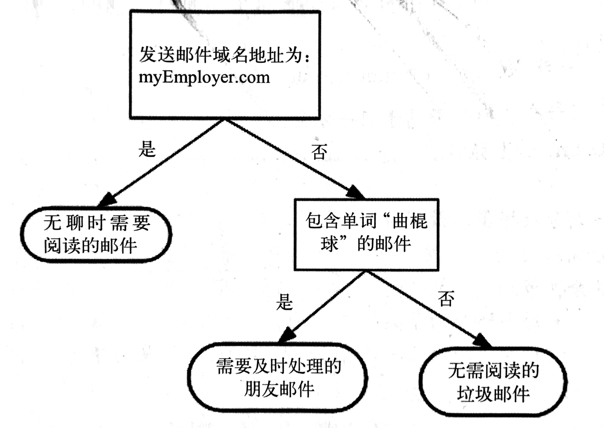
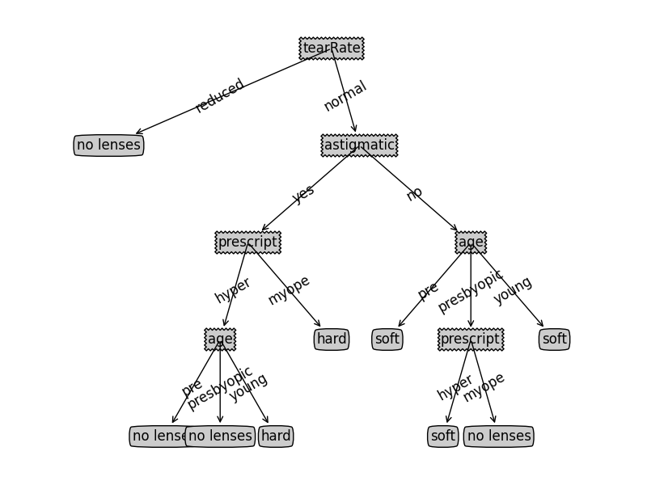

## 决策树
===

#### 决策树简介

你是否玩过二十个问题的游戏，游戏的规则很简单：参与游戏的一方在脑海中想象某个事物，其他参与者者向他提问题，只允许提20个问题，问题的答案也只能用对或错回答。问问题的人通过推断分解，逐步缩小待猜测事物的范围。
`决策树`的工作原理与20个问题类似，用户输入一系列的数据，然后给出游戏的答案。我们经常使用决策树处理分类问题，近来的调查表明，决策树也是最经常使用的数据挖掘算法。它之所以如此流行，一个很重要的原因就是不需要了解机器学习的知识，就能搞明白决策树是如何工作的。



上边所示的图，就可以被称为是决策树，长方形代表`判断模块`，椭圆形代表`终止模块`，表示已经得出结论，可以终止运行。从判断模块引出的左右箭头被称为`分支`，它可以到达另一个判断模块或者终止模块。上图构造了一个假象的邮件分类系统，首先检测了邮箱的地址，接下来检测是否包含某一单词来决定是否为垃圾邮件。
上篇文章我们所学习的`k-近邻算法`可以完成很多分类任务，但是它最大的缺点就是无法给出数据的内在含义，决策树的主要优势在于数据形式非常容易理解。所以我们说，`决策树`的一个重要的任务是为了理解数据中所蕴含的知识信息，因此，决策树可以使用不熟悉的数据集合，并从中提取出一系列规则，这些机器根据数据集创建规则的过程，就是机器学习的过程。

> 决策树给出的结果往往可以匹敌在当前领域具有几十年工作经验的人类专家。

#### 决策树的构造

在构造决策树之前，我们首先来看一下决策树的优缺点：

> 优点：计算复杂度不高，输出结果容易理解，对中间值的缺失不敏感，可以处理不相关特征数据
> 缺点：可能会产生`过度匹配问题`
> 适用数据类型：数值型、标称型

- 使用`信息论`划分数据集

在构造决策树时，我们需要解决的第一个问题就是，哪个特征对于我们划分数据分类起决定性作用，在学习`k-近邻算法`的时候，我们在对社交网站进行升级时，对关键特征的选择是通过图中所分布的点来决定，这次我们通过`信息论`来计算和评估每个特征对分类的影响。
那么，如何划分数据集呢？我们约定，如果某个分支下的数据属于同一类型，则当前无需阅读的垃圾邮件已经正确的划分数据分类，无需进一步对数据集进行分割，如果数据自己内的数据不属于同一类型，则需要重复划分数据自己的过程，直到所有具有相同类型的数据均在一个数据子集内。
一些决策树算法采用二分法划分数据，但是我们使用`信息论`作为划分数据子集的工具。首先我们来了解一下什么是`信息增益`：

###### 信息增益

划分数据子集的大原则是：将无序的数据变得更加有序。有很多方法可以用于划分数据子集，每种方法各有优缺点。组织杂乱无章数据的一种方法就是使用信息论度量信息，信息论是量化处理信息的分支科学。我们可以在划分数据之前或者之后使用信息论度量信息的内容。
在划分数据集之前之后信息发生的变化称为`信息增益`，知道如何计算信息增益，我们就可以计算每个特征值划分数据获得的信息增益，获得信息增益最高的特征就是最好的选择。那么，如何计算信息增益呢？集合信息的度量方式称为`香农熵`，或者简称为`熵`。

- 熵，定义为信息的期望值，如果待分类的事务可能划分在多个分类之中，则符号X<sup>i</sup>的信息定义为：

```
l(x<sup>i</sup>) = -log<sup>2</sup>p(x<sup>i</sup>)
```

其中，p(x<sup>i</sup>)是选择该分类的概率。为了计算熵，我们需要计算所有类别所有可能值包含的信息期望值，通过下面的公事得到：

```
H = -求和（n, i=1） p(x<sup>i</sup>)log<sup>2</sup>p(x<sup>i</sup>)
```

其中，n是分类的数目。

> 注，由于github的markdown暂不支持数学公事，所以一些数学符号我暂时用文字或者math中的方法名称代替，比如说 sqrt 等等

下面我们使用代码来实现计算信息熵，创建名为`trees.py`的文件：

```python
from math import log

def calcShannonEnt(dataSet) :
    numEntries = len(dataSet) # 获得数据集中实例的总数
    labelCounts = {} # 创建数据字典，它的键值是最后一列的数值，每个键值都记录了当前类别出现的次数

    for featVec in dataSet :
        currentLabel = featVec[-1]

        if currentLabel not in labelCounts.keys() :
            labelCounts[currentLabel] = 0
        
        labelCounts[currentLabel] += 1

    shannonEnt = 0.0
    # 使用类别标签发生的频率，计算类别出现的概率，将用这个值计算熵
    for Key in labelCounts :
        prob = float(labelCounts[Key]) / numEntries
        shannonEnt -= prob * log(prob, 2)

    return shannonEnt
```

接下来我们创建一个简单的数据集：

```python
def createDataSet() :
    dataSet = [
      [1, 1, 'yes'],
      [1, 1, 'yes'],
      [1, 0, 'no'],
      [0, 1, 'no'],
      [0, 1, 'no']
    ]

    labels = ['no surfacing', 'flippers']
    return dataSet, labels
```

然后我们来测试一下上述内容

```python
>>> reload(trees)
<module 'trees' from 'trees.py'>
>>> myData, labels = trees.createDataSet()
>>> trees.calcShannonEnt(myData)
0.9709505944546686
```

**熵越高，则混合的数据也越多**，我们可以在集合中添加更多的分类，观察熵是如何变化的，这里我们新增一个名为`hello`的分类并测试

```python
>>> myData[0][-1] = 'hello'
>>> myData
[[1, 1, 'hello'], [1, 1, 'yes'], [1, 0, 'no'], [0, 1, 'no'], [0, 1, 'no']]
>>> trees.calcShannonEnt(myData)
1.3709505944546687

>>> myData[2][-1] = 'machine'
>>> myData
[[1, 1, 'hello'], [1, 1, 'yes'], [1, 0, 'machine'], [0, 1, 'no'], [0, 1, 'no']]
>>> trees.calcShannonEnt(myData)
1.9219280948873623
```

我们看到，分类越多，熵值越高。得到熵之后，我们就可以按照获取最大信息增益的方法划分数据集。下面我们来学习如何划分数据集，并创建决策树。

###### 划分数据集

我们将对每个特征划分数据集的结果计算一次信息熵，然后判断按照哪个特征划分数据集是最好的划分方式。我们来按照给定的特征划分数据集：

```python
 # 输入的参数分别为，待划分的数据集，划分数据集的特征，需要返回的特征的值
 # 注：python语言方法中传递的是列表的引用，为了不改变源数据，所以我们用一个新的变量来存储返回结果
def splitDataSet(dataSet, axis, value) :
    retDataSet = [] # 列表中的各个元素也是列表，我们要遍历数据集中的每个元素，一旦发现符合要求的值，则将其添加到新创建的列表中

    for featVec in dataSet :
        if featVec[axis] == value : # 将符合特征的数据抽取出来
            reducedFeatVec = featVec[: axis]
            reducedFeatVec.extend(featVec[axis+1 :])
            retDataSet.append(reducedFeatVec)
    
    return retDataSet
```

> 注：代码中用到的`append`与`extend`方法略有不同，extent是将当前列表的元素添加到源列表中，append意为将该列表作为元素添加至源列表中

我们可以这样理解这段代码，当我们按照某个特征划分数据集时，就需要将所有符合要求的元素抽取出来。接下来，我们看一下代码的效果：

```python
>>> reload(trees)
<module 'trees' from 'trees.py'>
>>> myData, labels = trees.createDataSet()
>>> trees.splitDataSet(myData, 0, 1)
[[1, 'yes'], [1, 'yes'], [0, 'no']]
>>> trees.splitDataSet(myData, 0, 0)
[[1, 'no'], [1, 'no']]
```

我们看到，当特征为0的时候，我们希望返回特征值为1的对象，我们看一下：

```python
[1, 1, 'yes'], [1, 1, 'yes'], [1, 0, 'no']
```

这3个对象的第一个特征值均为1，所以程序没问题，大家也可以测试下其他特征。接下来我们遍历整个数据集，找到最好的特征划分方式，熵计算将会告诉我们如何划分数据集是最好的数据组织方式。

###### 选择最好的数据集划分方式

```python
def chooseBestFeatureToSplit(dataSet) : 
    numFeatures = len(dataSet[0]) - 1 # 判断有多少个特征属性
    baseEntropy = calcShannonEnt(dataSet) # 获得整个数据集的原始香农熵
    bestInfoGain = 0.0
    bestFeature = -1

    for i in range(numFeatures) :  # 遍历数据集中所有的特征
        featList = [example[i] for example in dataSet] # 使用[列表推倒](https://www.baidu.com/s?wd=python%20列表推倒&rsv_spt=1&rsv_iqid=0xea8c6dc30000af65&issp=1&f=8&rsv_bp=0&rsv_idx=2&ie=utf-8&tn=baiduhome_pg&rsv_enter=1&rsv_sug3=24&rsv_sug1=20&rsv_sug7=100&rsv_sug2=0&inputT=5475&rsv_sug4=6400)来创建新的列表
        uniqueVals = set(featList) # 使用set将list去重
        newEntropy = 0.0

        for value in uniqueVals : # 遍历当前特征中所有唯一的属性值，对每个唯一的属性值划分一次数据集
            subDataSet = splitDataSet(dataSet, i, value) 
            prob = len(subDataSet) / float(len(dataSet))
            newEntropy += prob * calcShannonEnt(subDataSet) # 计算熵，求和

        infoGain = baseEntropy - newEntropy

        if (infoGain > bestInfoGain) : # 比较所有特征的熵（信息增益），返回用于划分的最好特征的索引值
            bestInfoGain = infoGain
            bestFeature = i
    
    return bestFeature
```

该函数实现了选取特征，划分数据集，计算出最好的划分数据集的特征的功能。调用该函数需要满足一定的要求：1. 数据必须是一种由列表元素组成的列表，而且所有列表元素的长度都相同。 2. 数据的最后一列或者每个实例的最后一个元素是当前实例的类别标签。3. 我们无需先定list中的数据类型。

运行得出结果：

```python
>>> reload(trees)
<module 'trees' from 'trees.py'>
>>> myData, labels = trees.createDataSet()
>>> trees.chooseBestFeatureToSplit(myData)
0
```

###### 构建决策树

得到原始数据集，然后基于最好的属性值划分数据集，由于特征值可能多于2个，因此可能存在大于两个分支的数据集划分，第一次划分后，数据将被向下传递到树分支的下一个节点，在这个节点上，我们可以再次划分数据。因此，我们采用递归的方式处理数据集。递归结束的条件是：程序遍历完所有划分数据集的属性，或者每个分支下的所有实例都具有相同的分类，如果实例都具有相同的分类，则得到一个叶子节点或者终止块，任何到达叶子节点的数据必然属于叶子节点的分类。如果数据集已经处理了所有属性，但是类标签依然不是唯一的，此时我们需要决定如何定义该叶子节点，在这种情况下，我们通常会采用多数表决的方式决定该叶子节点的分类。

首先在trees.py中

```python
import operator
```

```python
def majorityCnt(classList) : # 分类名称的列表
    classCount = {}

    for vote in classList :
        if vote not in classCount.keys() : classCount[vote] = 0

        classCount[vote] += 1 # 存储每个列表标签出现的频率

    sortedClassCount = sorted(classCount.iteritems(), key=operator.itemgetter(1), reverse=True) # 排序并返回出现次数最多的分类名称
    return sortedClassCount[0][0]
```

接下来我们来创建树，大家细看注释：

```python
# 输入数据集、标签列表
def createTree(dataSet, labels) :
    classList = [example[-1] for example in dataSet] # 包含数据集所有的类标签
    if classList.count(classList[0]) == len(classList) :  
      return classList[0] # 所有的类标签完全相同，则直接返回该类标签
    
    if len(dataSet[0]) == 1 :
      return majorityCnt(classList) # 使用完了所有特征，仍然不能将数据集划分为仅包含唯一类别的分组，由于第二个终止条件无法简单的返回唯一的类标签，我们使用出现次数最多的累标签作为返回值

    # 开始创建树
    bestFeat = chooseBestFeatureToSplit(dataSet) # 存放最优特征列
    bestFeatLabel = labels[bestFeat] 

    myTree = {bestFeatLabel:{}} # 使用字典存储树的信息
    del(labels[bestFeat])

    featValues = [example[bestFeat] for example in dataSet]
    uniqueVals = set(featValues) # 得到列表包含的所有属性值

    for value in uniqueVals : # 遍历当前选择特征包含的所有属性值
        subLabels = labels[:] # 复制类标签
        myTree[bestFeatLabel][value] = createTree(splitDataSet(dataSet, bestFeat, value), subLabels) # 每个数据集调用上，递归调用函数创建树

    return myTree
```

运行上述代码：

```python
>>> reload(trees)
<module 'trees' from 'trees.py'>
>>> myData, labels = trees.createDataSet()
>>> myTree = trees.createTree(myData, labels)
>>> myTree
{'no surfacing': {0: 'no', 1: {'flippers': {0: 'no', 1: 'yes'}}}}
```

- 扩展：如何使用MapPlotlib绘制树

```python
>>> import treePlotter
>>> myTree = treePlotter.retrieveTree(0)
>>> myTree
{'no surfacing': {0: 'no', 1: {'flippers': {0: 'no', 1: 'yes'}}}}
>>> treePlotter.createPlot(myTree)
```

大家阅读下相关代码

###### 测试算法

我们继续在trees.py中添加方法，一个使用决策树的分类方法：

```python
def classify(inputTree, featLabels, testVec) :
    firstStr = inputTree.keys() [0]
    secondDict = inputTree[firstStr]

    featIndex = featLabels.index(firstStr)

    for key in secondDict.keys() :
      if testVec[featIndex] == key :
        if type(secondDict[key]).__name__ == 'dict' :
          classLabel = classify(secondDict[key], featLabels, testVec)
        else: classLabel = secondDict[key]
    
    return classLabel
```

进行测试：

```python
>>> reload(trees)
<module 'trees' from 'trees.py'>
>>> myData, labels = trees.createDataSet()
>>> labels
['no surfacing', 'flippers']
>>> myTree = treePlotter.retrieveTree(0)
>>> myTree
{'no surfacing': {0: 'no', 1: {'flippers': {0: 'no', 1: 'yes'}}}}
>>> trees.classify(myTree, labels, [1, 0])
'no'
>>> trees.classify(myTree, labels, [1, 1])
'yes'
```

上面代码中，myTree我们是从`treePlotter`中获取的已经手工将之前创建号的树写死到代码里的，但是实际情况中，我们需要把树保存到本地供使用，所以我们来看下如何保存树，也就是决策树的存储。

###### 决策树的存储

我们依旧在trees.py中添加以下2个方法：

```python
def storeTree(inputTree, filename) :
    import pickle

    fw = open(filename, 'w')
    pickle.dump(inputTree, fw)
    fw.close

def grabTree(filename) :
    import pickle
    
    fr = open(filename)
    return pickle.load(fr)
```

接下来，我们验证一下效果：

```python
>>> reload(trees)
<module 'trees' from 'trees.py'>
>>> trees.storeTree(treePlotter.retrieveTree(0), 'sTree.txt')
>>> trees.grabTree('sTree.txt')
{'no surfacing': {0: 'no', 1: {'flippers': {0: 'no', 1: 'yes'}}}}
>>>
```

#### 示例工程，使用决策树预测隐形眼睛类型

样本文件我存放到了跟代码以及的目录下，大家可以使用。

```python
>>> fr = open('lenses.txt')
>>> lenses = [inst.strip().split('\t') for inst in fr.readlines()]
>>> lensesLabels = ['age', 'prescript', 'astigmatic', 'tearRate']
>>> lensesTree = trees.createTree(lenses, lensesLabels)
>>> lensesTree
{'tearRate': {'reduced': 'no lenses', 'normal': {'astigmatic': {'yes': {'prescript': {'hyper': {'age': {'pre': 'no lenses', 'presbyopic': 'no lenses', 'youn
g': 'hard'}}, 'myope': 'hard'}}, 'no': {'age': {'pre': 'soft', 'presbyopic': {'prescript': {'hyper': 'soft', 'myope': 'no lenses'}}, 'young': 'soft'}}}}}}
>>> treePlotter.createPlot(lensesTree)
```

并且我们得到了树图：



#### 小结

决策树分类器就像带有终止块的流程图，终止块表示分类结果，开始处理数据集时，我们首先测量数据的不一致性，也就是熵，然后寻找最优方案划分数据集，直到数据集中的所有数据属于同一分类。